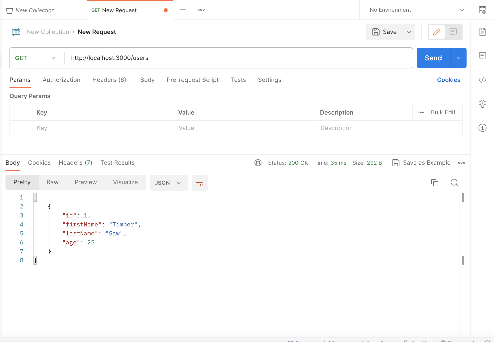
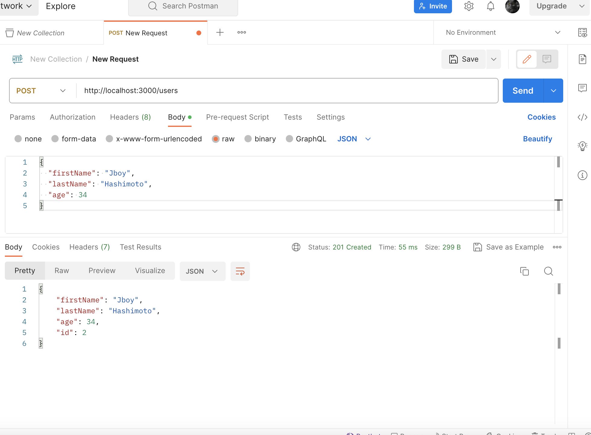

# TypeORM で MySQL を使う

雛形のプロジェクトを作成する。

```bash
npx typeorm init --name MyProject --database mysql
```

作成したフォルダへ移動して、依存関係をインストールする。

```bash
cd MyProject
npm install
```

このようなファイル群が作成される。

```
MyProject
├── src                   // place of your TypeScript code
│   ├── entity            // place where your entities (database models) are stored
│   │   └── User.ts       // sample entity
│   ├── migration         // place where your migrations are stored
│   ├── data-source.ts    // data source and all connection configuration
│   └── index.ts          // start point of your application
├── .gitignore            // standard gitignore file
├── package.json          // node module dependencies
├── README.md             // simple readme file
└── tsconfig.json         // TypeScript compiler options
```

## データベースを作成しておく

今回は、MySQL のデータベース名は、`local_db`とする。

```bash
CREATE DATABASE local_db;
```

ローカルの MySQL に接続できるように、データーベース名、ユーザー名、パスワードを設定する。

```ts
import "reflect-metadata";
import { DataSource } from "typeorm";
import { User } from "./entity/User";

export const AppDataSource = new DataSource({
  type: "mysql",
  host: "localhost",
  port: 3306,
  username: "root",
  password: "1234",
  database: "local_db",
  synchronize: true,
  logging: false,
  entities: [User],
  migrations: [],
  subscribers: [],
});
```

npm start を実行すると、`local_db`に ORM で定義したテーブルが作成される。

```bash
npm start
```

こんな感じです。

```
mysql> show databases;
+--------------------+
| Database           |
+--------------------+
| information_schema |
| jobpit-db          |
| local_db           |
| mysql              |
| performance_schema |
| PlaySample         |
| sys                |
| test               |
+--------------------+
8 rows in set (0.00 sec)

mysql> show tables;
+--------------------+
| Tables_in_local_db |
+--------------------+
| user               |
+--------------------+
1 row in set (0.00 sec)
```

## POSTMAN で動作確認

HTTP GET する時は、`http://localhost:3000/users`にアクセスする。

```
http://localhost:3000/users
```

HTTP POST するときは、`http://localhost:3000/users`にアクセスする。

```
{
  "firstName": "Jboy",
  "lastName": "Hashimoto",
  "age": 34
}
```


**HTTP GET**


**HTTP POST**

